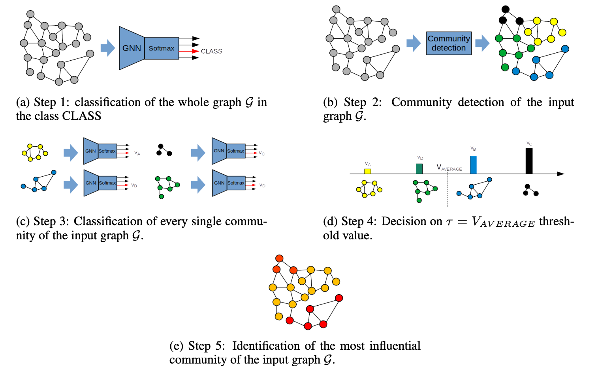

# GECo

`geco-explainer` is a Python library that provides an implementation of the `GECo` algorithm for explaining graph neural network predictions using leveraging community subgraphs.



## Installation

You can install `geco-explainer` via pip:

```bash
 pip install geco-explainer
```

[](https://pepy.tech/projects/geco-explainer)

If you use this algorithm, please cite:
```
@misc{calderaro2024gecoalgorithmgraphneural,
      title={The GECo algorithm for Graph Neural Networks Explanation}, 
      author={Salvatore Calderaro and Domenico Amato and Giosuè Lo Bosco and Riccardo Rizzo and Filippo Vella},
      year={2024},
      eprint={2411.11391},
      archivePrefix={arXiv},
      primaryClass={cs.LG},
      url={https://arxiv.org/abs/2411.11391}, 
}

```
